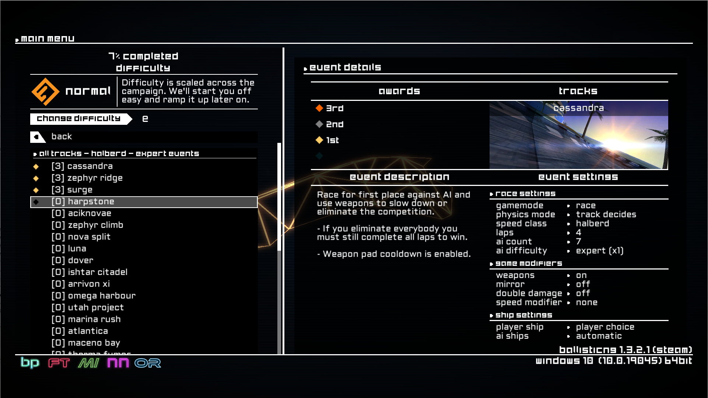

# BallisticNG Campaign Generator



Tool to easily create custom campaigns in BallisticNG from a large number of tracks.

The generated campaign will contain a single race event for every level read from a file, and a big tournament event containing all the races.

Once the XMl files are generated, add them to the game by copying to the BallisticNG directory:

```
BallisticNG/User/Mods/Campaigns
```

## Pre-requisites

The tool is currently not designed to be packaged standalone, so you will need the following pre-requisites:
* Java
* Scala
* SBT

## Usage

Run via SBT `sbt run`, or via an IDE. I use IntelliJ. An XML file will be created in the `out` folder unless specified by `--outFileDirectory`.

## Config

Campaigns are built from the lists of level names in `src/main/resources/levels`,
all other info is provided via command line arguments.

Arguments can be passed from the command line to SBT:

```bash
sbt "run --levelFileName standard_levels --speedClass Toxic"
```

Or from the within sbt shell:

```sbt
run --levelFileName standard_levels --speedClass Toxic
```

Or by setting CLI arguments in the run configuration of your IDE, which would look like this:

```
--levelFileName standard_levels --speedClass Toxic
```

## Arguments

Arguments are supplied as a single string of space separated values, keys followed by their value.

```--key1 value1 --key2 value2 --key3 value3```

Example with most arguments set:

```
--levelFileName enai_siaon_levels --speedClass Halberd --difficulty Expert --campaignName "The Mega Campaign"
```

### --campaignName

Name of the campaign displayed in game.

Default: "Custom Campaign"

### --difficulty

One of:
* Novice
* Experienced
* Expert
* Elite
* Hardcore

Default: Expert

### --levelFileName

The name, without extension, of the `.txt` file in `src/main/resources/levels` which will be used to generate the campaign XML file.

Default: standard_levels

### --outFileDirectory

Additional directory which the output XML file will be written to. This directory must already exist.
You may wish to set this to your installation's campaign mods folder, for me this is:

```
C:/SteamLibrary/steamapps/common/BallisticNG/User/Mods/Campaigns
```

Default: `./out`

### --pointsToUnlockTournament

Number of points needed from beating the single races before the tournament can be accessed.

Default: 0

### --speedClass

One of:
* Toxic
* Apex
* Halberd
* Spectre
* Zen

Default: Halberd

## Level Text Files

Level text files in `src/main/resources/levels` are simple text files containing a list of level names. So far, there are two:
* [standard_levels](src/main/resources/levels/standard_levels.txt)
  * All forward tracks from the base game
* [enai_siaion_levels](src/main/resources/levels/enai_siaion_levels.txt)
  * All tracks from the incredible modder Enai Siaion, from the steam workshop collection ["Enai's Complete Track Pack (2017-2023)"](https://steamcommunity.com/workshop/filedetails/?id=1948759147)
  * Only the track names are reproduced in this repo, no IP is stolen

You can add more files to this folder. They must be `.txt` files, and you will need to point the generator to the new file using `--levelFileName your_file_name_without_extension`.

## Example output

Example XML files are included in the out directory:
* [out/generated_standard_levels.xml](out/generated_standard_levels.xml)
  * args used: `--levelFileName standard_levels --speedClass Halberd --difficulty Expert --campaignName "All Tracks - Halberd - Expert" --pointsToUnlockTournament 96`
* [out/generated_enai_siaion_levels.xml](out/generated_enai_siaion_levels.xml)
  * args used: `--levelFileName enai_siaion_levels --speedClass Halberd --difficulty Expert --campaignName "Enai Siaion Ultimate!" --pointsToUnlockTournament 180`
